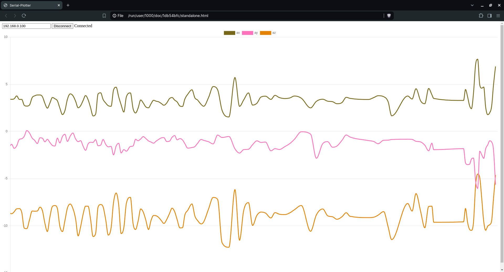

# Getting Started
## Clone the Repository
Clone the repository to your local machine using the following command:
```
https://github.com/rakesh-i/web-serial-plotter.git
```
## Connect to Wi-Fi
Open the example.ino file in the Arduino IDE.
Enter your Wi-Fi credentials in the code:
```
const char* ssid = "SSID";
const char* password = "PASSWORD";
```
Note down the IP from the serial monitor once ESP32 is connected to the local WIFI.

## Formatting data
Format the data as shown below to view on the serial plotter.
```
// Create a JSON string with the accelerometer data
String payload = "{";
payload += "\"ax\": " + String(a.acceleration.x) + ",";
payload += "\"ay\": " + String(a.acceleration.y) + ",";
payload += "\"az\": " + String(a.acceleration.z) ;
payload += "}";
```
The JSON message should have the key and the vaule pairs. The keys will be taken as label for the data. 
## Running the web-serial-plotter
Run "standalone.html" by clicking on it. It should open a webpage. If not right click and choose any browser for runner.
Make sure to be on the same local network as ESP32.
Type the IP in the input box and hit Connect. This should start the serial plotter. 


